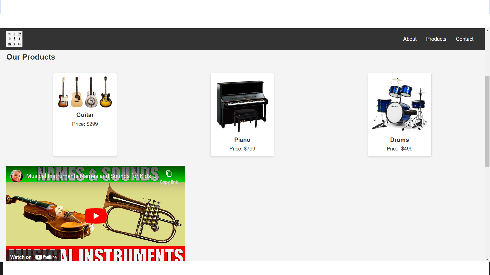

# Musical Instruments Landing Page



Welcome to the Musical Instruments Landing Page project! This project showcases a variety of musical instruments with a clean and responsive design.

## Table of Contents

- [Introduction](#introduction)
- [Features](#features)
- [Technologies Used](#technologies-used)
- [Setup](#setup)
- [Usage](#usage)
- [Screenshot](#screenshot)
- [License](#license)

## Introduction

This project is a landing page for a musical instruments store. It provides information about the store, displays a range of products, and includes a contact form for users to subscribe to the newsletter.

## Features

- Responsive design
- Fixed header with navigation links
- Product showcase with images and prices
- Embedded YouTube video
- Contact form with email subscription

## Technologies Used

- HTML
- CSS

## Setup

1. Clone the repository:
    ```sh
    git clone https://github.com/your-username/landing-page.git
    ```
2. Navigate to the project directory:
    ```sh
    cd landing-page
    ```

## Usage

Open [index.html](http://_vscodecontentref_/1) in your web browser to view the landing page.

## Screenshot

!Screenshot

## License

This project is licensed under the MIT License. See the [LICENSE](http://_vscodecontentref_/2) file for details.